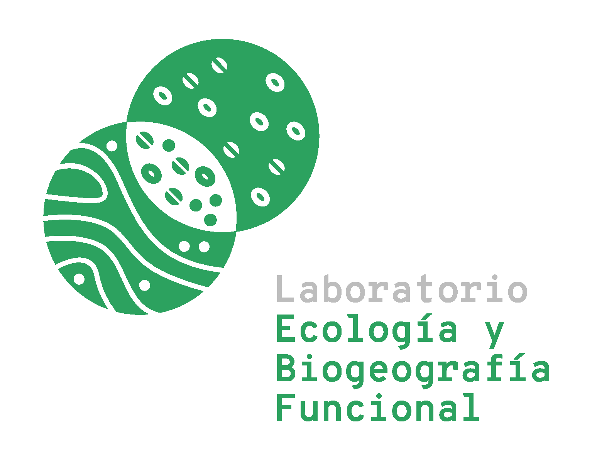

# Rasgos-CL: a functional trait database of Chilean woody plants 
### Authors: Elias Alfaro, Valentina Pérez-Tello, Manuel Acevedo, Juan Ovalle, Ricardo Segovia, Dylan Craven

The main objective of Rasgos-CL is to make trait data of Chile’s woody flora available for use by national and international scientific communities, decision makers, and practitioners.

Rasgos-CL contains 25,174 trait records, including 2 continuous and 21 categorical traits for 662 woody species. 

## Data use guidelines and availability  

**RasgosCL_AggregatedSpp.csv**: This file includes aggregated trait values at the species level, and includes standardized species names, trait values, trait names, and trait names, as well as the level of agreement across data sources for categorical traits and the number of data sources used to determine the trait value for each trait-species combination. 

**RasgosCL_longformat.csv**: This file provides trait information for trait each trait-species combination per data source (ID_record), including standardized trait values, trait units, and species names, as well as the original trait values and species names. 

**RasgosCL_References.csv**: This file contains the full reference for each data source. ID_reference can be linked to the column of the same in "RasgosCL_longformat_Version1.csv".

**RasgosCL_spp_names_clean.csv**: This file contains the species list used in Rasgos-CL, and includes standardized species, full names, families, and the taxon ID, name rank and source of the standardized species, and the 
original species and name.

## Citation and contact 

Data are publicly available but should be referenced by citing the corresponding data paper:

Alfaro, E., Pérez-Tello, V., Acevedo, M., Ovalle, J., Segovia, R., & Craven, D. (2023). Rasgos-CL: A functional trait database of Chilean woody plants. Global Ecology and Biogeography, 32, 2072–2084. https://doi.org/10.1111/geb.13755

Please contact [Dylan Craven](mailto:dylan.craven@aya.yale.edu) with questions.  

## Licence  
 
This work is licensed under a [Creative Commons Attribution 2.0 Generic License](https://creativecommons.org/licenses/by/2.0/).
